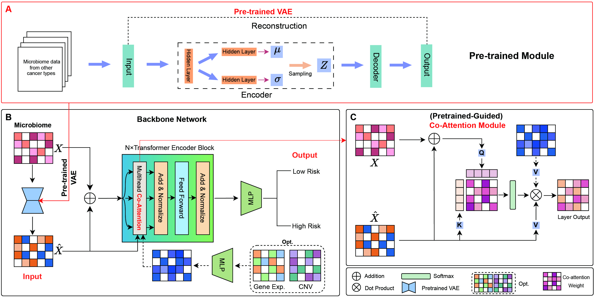

# VTrans: A VAE-based Pre-trained Transformer Method for Microbiome Data Analysis

## Introduction
In this paper, we introduce a VAE-based pre-trained Transformer method for microbiome data analysis deep learning model called VTrans, which is built upon a pre-trained VAE and Transformer encoder. The main goal of VTrans is to enhance the feature representation of individual datasets using a large-scale microbiome dataset of cancer patients, and to assess patient risk. Additionally, inspired by the concept of computer vision saliency maps, we calculate the saliency of microbiota to determine their impact on different cancer diseases, thus aiding in medical analysis. Initially, the microbial data of a cancer data is encoded by VAE to obtain a reconstructed representation containing latent feature distributions, and then added to the original data to obtain an enhanced representation of the data. Then, this enhanced representation, along with the reconstructed data, is fed into the cross co-attention Transformer module for feature reconstruction. Finally, the classification task is completed through a linear layer. It is worth noting that multi-modal data serves as an optional input. The multi-modal data is first passed through a feedforward neural network for dimensional transformation before being fed into the Transformer. After training the model, microbiome saliency computation is achieved using a method similar to saliency map calculation of computer vision. It is worth noting that the multimodal data is included as an optional module.

## Installations
* Windows
* NVIDIA GPU (both pretrained VAE and trained VTrans on a single Nvidia GeForce RTX 3090)
* ``pip install -r requiremnts.txt``

## Data preprocessing
If you wish to perform data preprocessing, you can run the script in the Jupyter folder.

## Pre-train VAE
``python pretrain_vae/vae_main.py``

## Training VTrans
``python VTrans/main.py``
